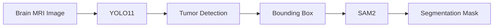
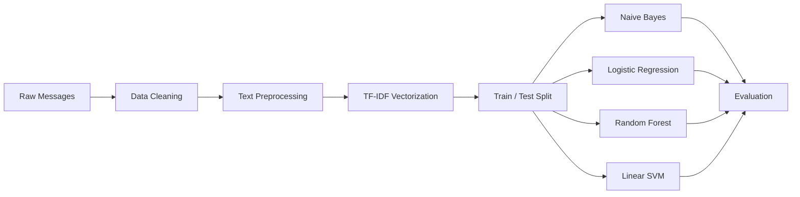

<!-- =========================================================
                       PROJECT HEADER
========================================================== -->

<p align="center">
  
</p>

<p align="center">
  
</p>

<p align="center">


</p>

---

# 🧠 AI & Machine Learning Learning Projects

This repository contains selected experiments completed while learning and practicing **Artificial Intelligence, Machine Learning, Computer Vision, and NLP**.

Rather than presenting these experiments as production-ready applications, this repository documents practical hands-on work used to understand:

- 👁️ Object detection
- 🎯 Image segmentation
- 🧠 Deep learning workflows
- 📝 Text classification
- 🔢 Feature extraction
- 🤖 Classical machine-learning algorithms
- 📊 Model evaluation
- ☁️ Google Colab experimentation

---

# 📚 Current Projects

| Project | Area | Main Technologies |
|---|---|---|
| 🧠 Brain Tumor Detection & Segmentation | Computer Vision | YOLO11, SAM2, Ultralytics |
| 📧 Spam Message Detection | NLP / Machine Learning | TF-IDF, scikit-learn |

---

# 🧠 1. Brain Tumor Detection & Segmentation

The first experiment explores a two-stage computer-vision workflow for analyzing brain MRI images.

```text
MRI Image
   ↓
YOLO11 Detection
   ↓
Tumor Bounding Box
   ↓
SAM2 Segmentation
   ↓
Tumor Region Mask
```

The experiment combines:

- **YOLO11** for object detection
- **SAM2** for segmentation

YOLO first identifies a suspected tumor region using a bounding box. That bounding box is then provided to SAM2 as a spatial prompt for segmentation.

---

## 🔍 Detection Stage

The experiment uses:

```python
YOLO("yolo11n.pt")
```

and trains the model using:

```text
Epochs      → 20
Image Size  → 640
Device      → GPU (device=0)
Framework   → Ultralytics
```

The original experiment was performed in **Google Colab**.

---

# ✂️ Segmentation Stage

After detection, the experiment loads:

```python
SAM("sam2_b.pt")
```

The detected YOLO bounding boxes are passed into SAM2:

```text
YOLO Detection
      ↓
Bounding Box Coordinates
      ↓
SAM2 Prompt
      ↓
Segmentation Mask
```

This demonstrates how an object detector and segmentation model can be combined into a simple vision pipeline.

---

# 🏗️ Brain Tumor Pipeline



---

# 🛠️ Brain Tumor Technologies

<p align="center">
  
</p>

Technologies and tools explored include:

`Python` • `Ultralytics` • `YOLO11` • `SAM2` • `PyTorch` • `Google Colab`

---

# ⚠️ Brain Tumor Experiment Notes

The current repository contains the experiment script but does **not** currently include:

- the MRI dataset
- `data.yaml`
- trained model weights
- example prediction images
- formal evaluation metrics
- a standalone requirements file
- a separate segmentation script

The original script also contains Google Colab / Google Drive paths such as:

```text
/content/drive/MyDrive/...
```

These paths must be changed before the experiment can be reproduced in another environment.

The script was exported from a Colab notebook and therefore also contains notebook-specific commands such as:

```python
!pip install ultralytics
```

For normal local Python execution, dependencies should instead be installed from the terminal.

---

# 🔬 Future Brain Tumor Improvements

If this experiment is revisited, useful next steps would include:

- [ ] Document the original dataset source
- [ ] Add reproducible dataset configuration
- [ ] Add `requirements.txt`
- [ ] Add trained-model metadata
- [ ] Record precision
- [ ] Record recall
- [ ] Record mAP
- [ ] Add sample detections
- [ ] Add sample segmentation masks
- [ ] Clean the exported Colab code
- [ ] Separate training and inference scripts
- [ ] Compare multiple detector variants
- [ ] Document hardware and training time
- [ ] Move the experiment into a dedicated repository if sufficiently developed

> No accuracy or performance numbers are reported here until the original
> experiment results are recovered and verified.

---

# 📧 2. Spam Message Detection

The second project explores **binary text classification** for distinguishing spam messages from legitimate messages.

The dataset labels are mapped as:

```text
ham  → 0
spam → 1
```

---

# 🧹 Text Processing

The experiment performs basic text preprocessing including:

- lowercase conversion
- punctuation removal
- email-pattern removal
- URL removal
- non-alphabetic character filtering
- numeric character removal
- whitespace processing

The processed messages are then converted into numerical features using:

## TF-IDF

```python
TfidfVectorizer(max_features=5000)
```

---

# 🧠 Models Compared

Four classical machine-learning algorithms are trained and evaluated.

### 1️⃣ Multinomial Naive Bayes

```text
MultinomialNB
```

### 2️⃣ Logistic Regression

```text
LogisticRegression
```

### 3️⃣ Random Forest

```text
RandomForestClassifier
```

### 4️⃣ Support Vector Machine

```text
SVC with linear kernel
```

---

# 🏗️ Spam Detection Pipeline



---

# 📊 Evaluation

The experiment evaluates each classifier using:

```text
Accuracy
Precision
Recall
F1-score
```

The script uses:

```python
accuracy_score()
classification_report()
```

The current repository does not store the original printed results, so no accuracy values are claimed in this README.

---

# ⚙️ Train/Test Configuration

The experiment currently uses:

```text
Training Data → 80%
Testing Data  → 20%
Random State  → 42
TF-IDF Limit  → 5,000 features
```

---

# ⚠️ Spam Dataset Requirement

The script expects a local file named:

```text
Spam Detection.csv
```

with columns including:

```text
Category
Message
```

That dataset is **not currently included in this repository**.

To reproduce the experiment, an appropriate dataset needs to be added or its path updated in:

```python
pd.read_csv("Spam Detection.csv")
```

---

# 📂 Repository Structure

The repository currently contains:

```text
Learning-projects-/
│
├── README.md
│
├── Tumor detection.py
│   └── YOLO11 + SAM2 brain MRI experiment
│
└── spam_detection_project.py
    └── TF-IDF spam classification experiment
```

This README intentionally reflects the files that actually exist in the repository.

---

# 🚀 Running the Experiments

These projects were created primarily as learning experiments rather than packaged applications.

## Clone the Repository

```bash
git clone https://github.com/Ibrahimshah0900/Learning-projects-.git
cd Learning-projects-
```

---

## Brain Tumor Experiment

Install the main dependency:

```bash
pip install ultralytics
```

The current script requires additional preparation before execution because:

- dataset paths point to Google Drive
- trained weights are not included
- dataset configuration is not included
- it contains Colab notebook syntax

The file is:

```text
Tumor detection.py
```

---

## Spam Detection Experiment

Install:

```bash
pip install pandas scikit-learn
```

Then provide the required:

```text
Spam Detection.csv
```

and run:

```bash
python spam_detection_project.py
```

---

# 🎓 What These Projects Demonstrate

These experiments helped develop practical familiarity with:

### 👁️ Computer Vision

- YOLO model training
- object detection
- inference
- bounding boxes
- segmentation
- combining multiple vision models

### 🧠 Machine Learning

- data preprocessing
- train/test splitting
- feature engineering
- classification
- model comparison
- evaluation metrics

### 📝 NLP

- text preprocessing
- TF-IDF vectorization
- spam classification

### ☁️ Experimentation

- Google Colab
- GPU training
- iterative model experimentation

---

# ⚠️ Repository Status

```text
Purpose             → Learning / Experimentation
Production Ready    → No
Brain Tumor Model   → Experiment completed in Colab
SAM2 Integration    → Present in experiment
Spam Classification → Implemented
Datasets Included   → No
Formal Benchmarks   → Not documented
Deployment          → Not included
```

This repository is preserved primarily as evidence of **learning progression and experimentation**.

---

# 🗺️ Future Organization

As individual experiments become more complete, they may be moved into dedicated repositories with:

- cleaner source-code structure
- reproducible environments
- documented datasets
- evaluation metrics
- trained model metadata
- screenshots
- sample predictions
- deployment instructions
- demos

The Brain Tumor YOLO11 + SAM2 experiment is the strongest candidate for a future standalone Computer Vision repository.

---

# 👨‍💻 Author

## Muhammad Ibrahim Hashmi

BS Artificial Intelligence

Interested in:

`Computer Vision` • `Machine Learning` • `Applied AI` • `Python`

<p>

<a href="https://github.com/Ibrahimshah0900">
  
</a>

</p>

---

<p align="center">
  
</p>

<p align="center">
  <b>🧠 Learn → Experiment → Evaluate → Improve</b>
</p>

<p align="center">
  
</p>
